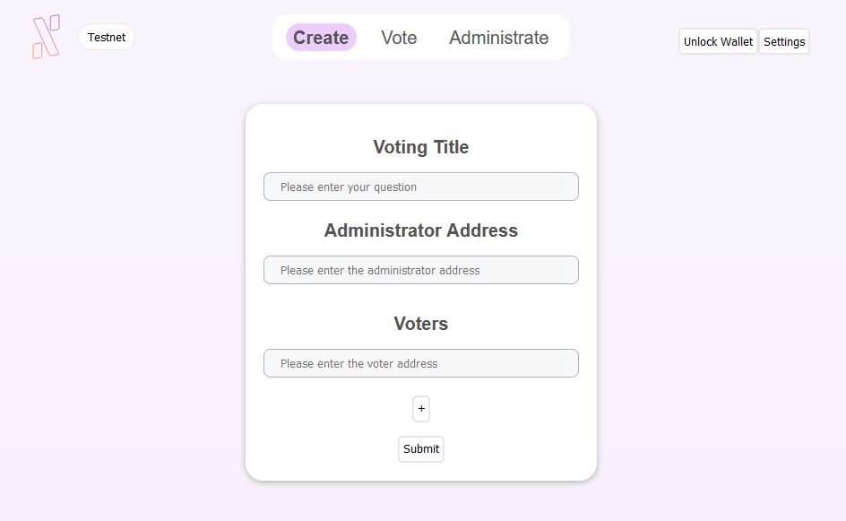
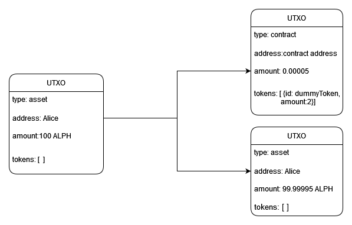
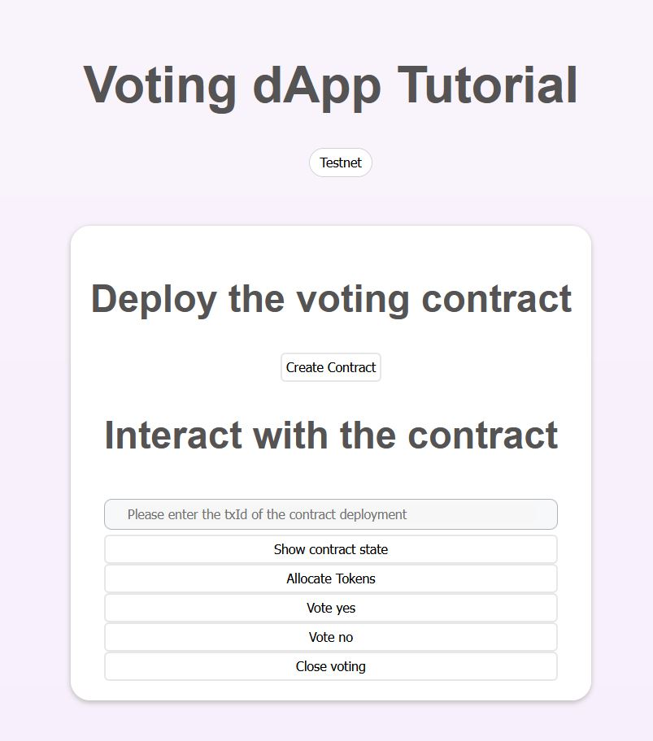

The goal of this tutorial is to guide you through the process of building a decentralized voting application on the Alephium blockchain. We will first present a simple voting protocol and describe the transactional model of the Alephium blockchain. Then we will implement the protocol as a smart contract and use a Typescript API client to deploy the contract on the blockchain testnet and allow users to vote. At the end of this guide you will have learnt how to build a simple application on Alephium and will be ready to implement your own idea with the frontend of your choice. As an example below is a screenshot of the full voting application which is accessible [here](https://github.com/alephium/voting-demo) (TODO: replace with deployed app URL). We will implement a minimalist version of this application using the same API client and contracts but a simpler UI in React. No prior React knowledge is not required.



## Table of Contents

- [Voting application protocol](#voting-application-protocol)
- [Alephium transactional model](#alephium-transactional-model)
- [Voting Smart Contracts](#voting-smart-contracts)
  - [Token allocation](#token-allocation)
  - [Vote](#vote)
  - [Close](#close)
- [Local node setup](#local-node-setup)
- [Project structure](#project-structure)
- [Contract Deployment in Typescript](#contract-deployment-in-typescript)
  - [Overview](#overview)
  - [Contract Generation](#contract-generation)
  - [Deployment](#deployment)
  - [Retrieve state](#retrieve-state)
  - [Token allocation](#token-allocation-1)
  - [Vote](#vote-1)
  - [Closing](#closing)
- [Experiments](#experiments)
- [Conclusion](#conclusion)


## Requirements

- Alephium [full node installed locally](https://wiki.alephium.org/Full-Node-Starter-Guide.html)
- Basic Javascript/Typescript knowledge
- NodeJS with npm

# Voting application protocol
We designed a very simple token-based voting protocol where each voter receives a single token that he can spend to vote `yes` or `no` to a proposal. Once the voting period is over, the administrator closes the voting and votes will no longer be accepted. In our case the voting protocol is the following:

1. An administrator opens the vote and sends a token to each voter
2. Each voter registers his vote in exchange of his token
3. The administrator closes the vote
4. Voters see the results of the vote

This protocol can be written as a smart contract, which is an interactive program deployed on a blockchain via a transaction. Smart ontracts can store information, perform computations and transfer money or tokens. They cannot be modified once deployed and the possible interactions are defined by the contract code. They allow to build decentralized applications which enable parties to follow a specific protocol without relying on a central authority.

In our case the contract will be the program that allows the administrator to send tokens to voters and to accept votes. As the blockchain is a public and decentralized system, everyone can see the voting results. Of course, the contract should reject invalid operations such as when someone tries to vote twice or when unauthorized users attempt to vote. But before diving into the contract code, we will give an overview of Alephium transactional model to understand how transfers are done on this blockchain.

*Disclaimer: This protocol is designed only for educational purposes*

# Alephium transactional model

Alephium is a sharded blockchain where addresses are randomly divided among `G` groups. For each pair of group `(i, j)` where `i` and `j` are in interval `[0, G -1]`, there is a blockchain which contains all transactions from group `i` to group `j`. Hence the Alephium network has in total `G x G` chains running in parallel. Currently we use `G = 4` on both the testnet and mainnet.

Alephium uses the UTXO (unspent transaction output) model for its native currency **ALPH**. In simple words a UTXO can be pictured like a coin that can be used only once by registering a transaction on the network. Each transaction takes some UTXOs as input and produces new UTXOs as output. For example if address  `Alice` in group `i` only has one UTXO of 100 **ALPH** and wants to transfer 10 **ALPH** to address `Bob` in group `j`, the transaction in the chain `(i, j)` will consume the 100 **ALPH** input UTXO (hence it can no longer be used) and produce two new UTXOs, one being the 90 **ALPH** for `Bob` and the other is the excess of money going back to `Alice`. In this model, the total amount of money owned by an address is simply the sum the address UTXOs. Just like you would sum the coins in your pocket wallet to count your money.


A UTXO can also contain a list of tokens owned by an address. However it is not possible to create a UTXO with some tokens and 0 **ALPH**. UTXOs should always have a small amount of **ALPH**. For example, let's say that `Alice` wants to organize a voting between two people. She writes and deploys a smart contract with two tokens, one for each voter.

The contract deployment transaction will generate two UTXOs. The first is of type "contract" which is assigned to the created contract address. It contains two units of a new token that must be transferred to voters and a small amount of **ALPH** payed by `Alice`. This UTXO can only be used by submitting a transaction which will trigger the execution of the contract logic. The second UTXO is owned by address `Alice` and is again the excess of money used for the transaction.



Smart contracts can only interact with addresses in the same group beacause they are supported in intra-group shards. This means that a contract deployed by an address in group `i` will have its created address in group `i` and the deployment transaction belongs to chain `(i, i)`. Finally, the contract can only interact or exchange assets with addresses in group `i`.

# Voting Smart Contracts

Alephium has its own programming language, *Fi-Lang* for dApps. It allows to build efficient and secure smart contracts. The language syntax is similar to Rust.

Smart contracts have a state (i.e list of voters, administrator address, vote counts) and methods (token allocation, vote registration, closing) that users can call. Contracts are written as a `TxContract` which is similar to a class in standard programming languages. Once the contract is deployed on the blockchain, users can submit a script `TxScript` which imports the contract and calls its functions.
The smart contract corresonding to our voting protocol with two voters is the following:

```rust
TxContract Voting(
     title: ByteVec,
     mut yes: U256,
     mut no: U256,
     mut isClosed: Bool,
     mut initialized: Bool,
     admin: Address,
     voters: [Address; 2]
    ) {
     pub payable fn allocateTokens() -> () {
        assert!(initialized == false)
        assert!(txCaller!(txCallerSize!() - 1) == admin)
        transferAlph!(admin, voters[0], 50000000000000)
        transferTokenFromSelf!(voters[0], selfTokenId!(), 1)
        transferAlph!(admin, voters[1], 50000000000000)
        transferTokenFromSelf!(voters[1], selfTokenId!(), 1)
        yes = 0
        no = 0
        initialized = true
     }

     pub payable fn vote(choice: Bool, voter: Address) -> () {
       assert!(initialized == true && isClosed == false)
       transferAlph!(voter, admin, ${utxoFee})
       transferTokenToSelf!(voter, selfTokenId!(), 1)
       if (choice == true) {
          yes = yes + 1
       } else {
          no = no + 1
       }
     }

      pub fn close() -> () {
        assert!(initialized == true && isClosed == false)
        assert!(txCaller!(txCallerSize!() - 1) == admin)
        isClosed = true
      }
}
```

The state of the contract is defined in the contract constructor. It has the following variables:
- `title: ByteVec`: Voting title encoded in hexadecimal
- `mut yes: U256`: Number of yes votes
- `mut no: U256`: Number of no votes
- `mut isClosed: Bool`: True when the vote is closed
- `mut initialized: Bool`: True when the administrator has allocated the tokens
- `admin: Address`: Administrator address
- `voters: [Address, 2]`: Fixed-size array of two voters Addresses


The initial value of these variable and the issued token supply are specified as HTTP parameters of the contract deployment query.
State variables are declared as immutable by default, meaning that their value cannot be changed. Mutable variables are prefixed by the `mut` keyword and can only be updated by invoking one the contract methods. Let's  examine each method in detail.

## Token allocation
```rust
pub payable fn allocateTokens() -> () {
  assert!(txCaller!(txCallerSize!() - 1) == admin)
  assert!(initialized == false)
  transferAlph!(admin, voters[0], 50000000000000)
  transferTokenFromSelf!(voters[0], selfTokenId!(), 1)
  transferAlph!(admin, voters[1], 50000000000000)
  transferTokenFromSelf!(voters[1], selfTokenId!(), 1)
  yes = 0
  no = 0
  initialized = true
}
```

This function `allocateTokens` can be broken down in three steps. First it checks that the caller's address is the one of the administrator and that the voting has not been initialized yet. Then it transfers one token to each voter, along with some **ALPH** from the administrator. Finally it initializes the vote counters to `0` and updates the `initialized` boolean, to ensure that the function can no longer be called. The `payable` modifier means that the function might use assets/coins from the caller.

It uses the following built-in functions:

* `assert!(pred)` Causes the contract execution to fail when `pred` evaluates to `false`
* `txCallerSize!()` Returns the number of addresses who triggered the execution of the contract, including the current caller.
* `txCaller!(i)` Returns the address of the i-th caller of the contract. The first caller is indexed by 0.
* `selfTokenId!()` Returns the id of the token associated to the contract. It is equivalent to the contractId
* `transferAlph!(from, to, alphAmount)` Transfers `alphAmount` **ALPH** from address `from` to `to`.
* `transferTokenFromSelf!(to, tokenId, tokenAmount)` Transfers `tokenAmount` tokens with id  `tokenId` from the current contract to address `to`.

To trigger the token allocation, the administrator will submit a transaction containing the following `TxScript`.

```rust
TxScript TokenAllocation {
    pub payable fn main() -> () {
      let voting = Voting(#contractId)
      let caller = txCaller!(0)
      approveAlph!(caller, 50000000000000 * 2)
      voting.allocateTokens()
    }
}
```

The main function of the script will be executed. The script loads the contract, then it approves some **ALPH** to be used in the next payable function call `voting.allocateTokens`. Finally it calls the token allocation function of the contract. The builtin function call `approveAlph!(caller, 50000000000000 * 2)` is mandatory because a contract cannot use assets from other addresses without an explicit approval by the owner. Any excess of approved assets will return to the owner as UTXOs like in the example with `Alice` and `Bob`.


You might be wondering why the administrator sends some **ALPH** to each voter? Couldn't we just transfer the tokens? From the previous section, you should remember that tokens are contained in UTXOs, and every UTXO needs to have a small amount of **ALPH**. For each voter, the transaction will create a UTXO with a single token unit and `50000000000000` **ALPH** paid the administrator. Voters will send this amount back to the administrator when voting.

## Vote

The function called by voters to vote is the following:

```rust
pub payable fn vote(choice: Bool, voter: Address) -> () {
   assert!(initialized == true && isClosed == false)
   transferAlph!(voter, admin, 50000000000000)
   transferTokenToSelf!(voter, selfTokenId!(), 1)
   if (choice == true) {
    yes = yes + 1
   } else {
    no = no + 1
   }
}
```
First it checks that the administrator has initialized the voting and that it has not been closed. Then voters send their token to the contract and send back to administrator the UTXO creation fee we talked about. Finally the vote is registered by incrementing one of the counters. Since the `initialized` variable evaluates to `true`, the administrator cannot call the `allocateTokens` function a second time. Hence, returned tokens cannot be transferred to anyone and will be owned by the contract forever.


The corresponding `TxScript` to vote yes is the following:

```rust
TxScript VotingScript {
   pub payable fn main() -> () {
     let caller = txCaller!(0)
     let voting = Voting(#contractid)
     approveToken!(caller, #contractid, 1)
     approveAlph!(caller, 50000000000000)
     voting.vote(true, caller)
   }
}
```
This function simply approves the token and **ALPH** to be used and then calls the `vote` function.

## Close
At the end of the voting period, the administrator calls the `close()` function of the contract. The implementation is straightforward.

```rust
pub fn close() -> () {
  assert!(initialized == true && isClosed == false)
  assert!(txCaller!(txCallerSize!() - 1) == admin)
  isClosed = true
}
```
You will remark that no assets are used by the function, hence it does not require the `payable modifier`. The associated `TxScript` is the following:

```rust
TxScript ClosingScript {
   pub fn main() -> () {
      let voting = Voting(#contractId)
      voting.close()
   }
}
```

Great! Now we will use Typescript to deploy the contracts and interact with them using a node running locally.

# Local node setup
Please install and run locally a node on the **testnet** following [this guide](https://wiki.alephium.org/Testnet-Guide.html). Then create a miner wallet a described [here](https://wiki.alephium.org/GPU-Miner-Guide.html) if you don't have one yet. Miner wallets have one address per group, hence 4 addresses. You can easily obtain coins on the testnet by running [the CPU miner](https://wiki.alephium.org/CPU-Miner-Guide.html) with the addresses of one your wallet.

# Project structure

Clone the tutorial repository install the dependencies and run the application.

```
$ git clone https://github.com/alephium/voting-tutorial.git
$ npm install
$ npm run start
```

The following React application should open at URL `http://localhost:3000`. This app is a very minimalist reproduction of the original application so we can focus on the code to deploy the contract and interact with it. We will just implement the logic behind each button.




The files of interest for this tutorial are the following:

```
src
├── App.tsx # React application
└── util
    ├── client.tsx # Node API client
    └── voting.tsx # Helper functions to create contracts and script code
```

Open the file `App.tsx`. The application is a simple component `App` which defines a few settings:  the URL of the local node, the explorer URL and a wallet for each voter. Please make sure you have created a miner wallet with some funds on your local node as explained in the [wallet guide](https://wiki.alephium.org/Wallet-Guide.html).

The component state variable `contractDeploymentId` is bound to the page input. Then an instance of the node API  client `Client` in `src/util/client.tsx` is created. This client is a wrapper around the [`alephium-js`](https://github.com/alephium/alephium-js) library. It provides methods to easily deploy your contract and interact with it. Finally, the callback function of each button is defined but must be implemented. We will guide you through their implementation step-by-step.

```tsx
const App = () => {
  const settings = {
    nodeHost: 'http://localhost:12973',
    explorerURL: 'https://testnet.alephium.org',
    wallet1: {
      name: 'wallet-1',
      password: 'my-secret-password'
    }
  }

  const [contractDeploymentId, setContractDeploymentId] = useState('')
  const client = new Client(settings.nodeHost, settings.wallet1.name, settings.wallet1.password)

  const deployNewContract = async () => {
    return Promise.reject('Not implemented yet')
  }

  const showState = async (contractDeploymentId: string) => {
    return Promise.reject('Not implemented yet')
  }

  const allocateTokens = async (contractDeploymentId: string) => {
    return Promise.reject('Not implemented yet')
  }

  const vote = async (contractDeploymentId: string, choice: boolean) => {
    return Promise.reject('Not implemented yet')
  }

  const close = async (contractDeploymentId: string) => {
    return Promise.reject('Not implemented yet')
  }

  return (
    <div className="App">
      <header className="App-header">
        <h1>Voting dApp Tutorial</h1>
        <div className="container">
          <h2>Deploy the voting contract</h2>
          <button onClick={() => catchAndAlert(deployNewContract())}>Create Contract</button>
          <div style={{ display: 'flex', flexDirection: 'column' }}>
            <h2>Interact with the contract</h2>
            <div className="styledInputDiv">
              <input
                type="text"
                placeholder="Please enter the txId of the contract deployment"
                onChange={(e) => setContractDeploymentId(e.target.value)}
                value={contractDeploymentId}
              />
            </div>
            <button onClick={() => catchAndAlert(showState(contractDeploymentId))}>Show contract state</button>
            <button onClick={() => catchAndAlert(allocateTokens(contractDeploymentId))}>Allocate Tokens</button>
            <button onClick={() => catchAndAlert(vote(contractDeploymentId, true))}>Vote yes</button>
            <button onClick={() => catchAndAlert(vote(contractDeploymentId, false))}>Vote no</button>
            <button onClick={() => catchAndAlert(close(contractDeploymentId))}>Close voting</button>
          </div>
        </div>
      </header>
    </div>
  )
}
```
We will first implement the `deployNewContract` function.

# Contract Deployment in Typescript

## Overview
To deploy a `TxContract` on the network we need to have a full node running locally. We will query the following REST API endpoints:

1. `POST /wallet/unlock/{wallet_name}` Unlocks the user wallet
2. `GET /wallets/addresses/{wallet_name}` To retrieves the public key of the active address
3. `POST /contracts/compile-contract` Compiles the contract given as a string
4. `POST /contracts/build-contract` Builds an unsigned transaction with the compiled contract and our public key
5. `POST /wallets/sign` Signs the unsigned  transaction hash
6. `POST /transactions/submit` Submits the signed transaction to the network

The process to execute a `TxScript` is similar except that we'll query endpoints `POST /contracts/compile-script` and `POST /contracts/build-script` to compile and build the transaction.

Below are the methods of the class `Client` in `src/util/client.tsx` that can query these endpoints.

```tsx
import {
  Api,
  //other imports
} from 'alephium-js/dist/api/api-alephium'

Client {
  api: Api<unknown>
  walletName: string
  password: string

  constructor(baseUrl: string, walletName: string, password: string) {
    const apiConfig: ApiConfig = {
      baseUrl: baseUrl
    }
    this.api = new Api(apiConfig)
    this.walletName = walletName
    this.password = password
  }

  async walletUnlock() {
    return this.fetch(
      this.api.wallets.postWalletsWalletNameUnlock(this.walletName, {
        password: this.password
      })
    )
  }
  /*other methods...*/

  async getActiveAddress(): Promise<string> {
    return (await this.fetch(this.api.wallets.getWalletsWalletNameAddresses(this.walletName))).activeAddress
  }

  async sign(data: string): Promise<string> {
    return this.fetch(this.api.wallets.postWalletsWalletNameSign(this.walletName, { data: data })).then((result) => {
      return result.signature
    })
  }

  async deployContract(contract: string, gas: number, state: string, issueTokenAmount: string): Promise<TxResult> {
    return this.compileContract(contract)
      .then((compileResult) => this.buildContract(compileResult, gas, state, issueTokenAmount))
      .then(async (buildContract: BuildContractResult) => {
        const signature = await this.sign(buildContract.hash)
        return this.submit(buildContract.unsignedTx, signature)
      })
  }

  async deployScript(script: string): Promise<TxResult> {
    return this.compileScript(script)
      .then(this.buildScript)
      .then(async (buildScriptResult: BuildScriptResult) => {
        const signature = await this.sign(buildScriptResult.hash)
        return this.submit(buildScriptResult.unsignedTx, signature)
      })
  }
  /* ...*/
```
Steps 1 and 2 are done with methods `walletUnlock` and `getActiveAddress`.
Steps 3 - 6 are done with method `deployContract` for a `TxContract` and `deployScript` for a `TxScript`.

*Note: Each wallet has one its addresses declared as **active**. This active address will be selected to retrieve the publicKey and to sign data. You can change the wallet  active address with endpoint `POST /wallets/{wallet_name}/change-active-address`*

## Contract Generation
Open the file  `src/util/voting.tsx` and paste the following function which returns the contract as a string for a given number of voters.
```Typescript
const utxoFee = '50000000000000'
export function createContract(nVoters: number): string {
  const votersTransfers: string[] = []
  for (let i = 0; i < nVoters; i++) {
    votersTransfers.push(`transferAlph!(admin, voters[${i}], ${utxoFee})`)
    votersTransfers.push(`transferTokenFromSelf!(voters[${i}], selfTokenId!(), 1)`)
  }
  return `
   TxContract Voting(
     title: ByteVec,
     mut yes: U256,
     mut no: U256,
     mut isClosed: Bool,
     mut initialized: Bool,
     admin: Address,
     voters: [Address; ${nVoters}]
   ) {
     pub payable fn allocateTokens() -> () {
        assert!(initialized == false)
        assert!(txCaller!(txCallerSize!() - 1) == admin)
        ${votersTransfers.join('\n')}
        yes = 0
        no = 0
        initialized = true
     }

     pub payable fn vote(choice: Bool, voter: Address) -> () {
       assert!(initialized == true && isClosed == false)
       transferAlph!(voter, admin, ${utxoFee})
       transferTokenToSelf!(voter, selfTokenId!(), 1)
       if (choice == true) {
          yes = yes + 1
       } else {
          no = no + 1
       }
     }

      pub fn close() -> () {
        assert!(initialized == true && isClosed == false)
        assert!(txCaller!(txCallerSize!() - 1) == admin)
        isClosed = true
      }
    }`
}
```

In the same file add the following functions to create the initial state of the contract as a string. The string should have the following format `[#encodedTitle, 0, 0, false, false, @administratorAddress, [@voter1Address, @voter2Address]]`.
Note that the title is encoded as an hexadecimal string prefixed by `#` as it is a `ByteVec`. Addressses are prefixed by `@`.

```tsx
export function initialContractState(title: string, adminAddress: string, voters: string[]): string {
  return `[#${strToHexString(title)}, 0, 0, false, false, @${adminAddress}, [${voters
    .map((voter) => `@${voter}`)
    .join(', ')}]]`
}

export function strToHexString(str: string) {
  return Buffer.from(str).toString('hex')
}

export function hexStringToStr(str: string) {
  return Buffer.from(str, 'hex').toString()
}
```

## Deployment

Finally  in `App.tsx` add the following imports:

```tsx
import {
  createContract,
  initialContractState
} from './util/voting'
import { CONTRACTGAS } from './util/client'
import { TxResult } from 'alephium-js/dist/api/api-alephium'
```
Below is the implementation of the `deployNewContract` function. It unlocks the wallet, declares the voting title, the voters addresses and the administrator address. Finally we generate the contract code and deploy it with an initial state. The number of tokens issued to the contract is equal to the number of voters. For simplicity, we organize the voting for a single voter but you can add addresses to the list. Since smart contracts are supported in intra-group shards as explained in the [*Alephium transactional model*](#alephium-transactional-model) section, keep in mind that all voters addresses should be in the same group as the administrator address.

```tsx
const deployNewContract = async () => {
  await client.walletUnlock()
  const wallet1Address = await client.getActiveAddress()
  const votingSetup = {
    title: 'My first voting contract',
    voters: [wallet1Address],
    administrator: wallet1Address
  }
  const contractStringCode = createContract(votingSetup.voters.length)
  const state = initialContractState(votingSetup.title, votingSetup.administrator, votingSetup.voters)
  const contractTxResult: TxResult = await client.deployContract(
    contractStringCode,
    CONTRACTGAS,
    state,
    `${votingSetup.voters.length}`
  )
  logTransactionUrl(settings.explorerURL, contractTxResult.txId)
}
```

Let's deploy your contract! Right-click on the web page and select `inspect`. Open the browser console and only then click on the `Create contract` button. You will see the API calls to your local node and the link to your pending transaction on the testnet explorer. Open the link in a new browser tab and wait for the transaction to be confirmed.

## Retrieve state
Now let's implement the function `showState`.
Import the contract state fields data types and the `hexStringToStr` function.

```tsx
import { createContract, initialContractState, hexStringToStr } from './util/voting'
import { Address, Bool, ByteVec, U256, TxResult } from 'alephium-js/dist/api/api-alephium'
```

Then implement the function in order to fetch the contract state, extract the fields and displays them:

```tsx
const showState = async (contractDeploymentId: string) => {
  const state = await client.getContractState(contractDeploymentId)
  const title = hexStringToStr((state.fields[0] as ByteVec).value)
  const yes = (state.fields[1] as U256).value
  const no = (state.fields[2] as U256).value
  const isClosed = (state.fields[3] as Bool).value
  const initialized = (state.fields[4] as Bool).value
  const admin = (state.fields[5] as Address).value
  const voters = state.fields.slice(6, state.fields.length).map((val) => val.value)
  const stateString = `
    Title: ${title}
    Yes: ${yes}
    No: ${no}
    isClosed: ${isClosed}
    initialized: ${initialized}
    admin: ${admin}
    voters: [${voters}]
    `
  alert(stateString)
  console.log(stateString)
}
```

Finally, write the transaction hash of the previous contract deployment in web page input. Click on the button `Show contract state`. A dialog with the contract state should open.

*Note: Arrays in Fi-Lang are currently syntactic sugar over single variables. The compiler will replace the array `voters:Array[Address, n]` of the contract by variables `voters-1:Address` , `voters-2:Address` ... `voters-n:Address`. Hence when fetching the state, the node will not return an array of addresses for the voters but distinct `Address` variables. This explains why we need to `slice` on the end of the list `state.fields` to construct a list of addresses.*

## Token allocation

Now is time to allocate tokens to voters. In `util/voting.tsx`, add the function to generate the `TxScript`. Note that the contract code must be inlined after the script.

```tsx
export function allocateTokenScript(contractRef: ContractRef, nVoters: number): string {
  return `TxScript TokenAllocation {
    pub payable fn main() -> () {
      let voting = Voting(#${contractRef.tokenId})
      let caller = txCaller!(0)
      approveAlph!(caller, ${utxoFee} * ${nVoters})
      voting.allocateTokens()
    }
  }
  ${createContract(nVoters)}
  `
}
```
It uses the `ContractRef` interface defined in `src/util/client.tsx`:

```tsx
export interface ContractRef {
  contractAddress: string
  tokenId: string
}
```

The contract address is useful to retrieve the state of a contract. The tokenId allows us to reference the correct contract and tokens in our `TxScript`. Given a contract deployment `txId` (transaction hash) we can obtain the corresponding `ContractRef` using `client.getContractRef(txId)`. This method parses the UTXO of type `contract` created as output of the deployment transaction to retrieve the fields `address` and `tokens[0].id`. Then it returns a `ContractRef` with the two values.

Finally, add `allocateTokenScript` to the list of imports and implement the `allocateTokens` function.

```tsx
import { createContract, initialContractState, hexStringToStr , allocateTokenScript} from './util/voting'
```
```tsx
const allocateTokens = async (contractDeploymentId: string) => {
  const contractRef = await client.getContractRef(contractDeploymentId)
  const nVoters = await client.getNVoters(contractDeploymentId)
  const txScript = allocateTokenScript(contractRef, nVoters)
  const txResult = await client.deployScript(txScript)
  logTransactionUrl(settings.explorerURL, txResult.txId)
}
```

Fill the input with the contract deployment transaction hash and click on button `allocateTokens` to test the functionality. Again you can see the link to the testnet explorer in the browser console. Once the transaction is confirmed, take a look at the state to observe that variable `initialized = true`.

## Vote

We go through a similar process to vote. In `util/voting.tsx` add the following to create the voting script:

```tsx
export function createVotingScript(choice: boolean, contractRef: ContractRef, nVoters: number): string {
  return `TxScript VotingScript {
      pub payable fn main() -> () {
        let caller = txCaller!(0)
        let voting = Voting(#${contractRef.tokenId})
        approveToken!(caller, #${contractRef.tokenId}, 1)
        approveAlph!(caller, ${utxoFee})
        voting.vote(${choice}, caller)
      }
    }
    ${createContract(nVoters)}
    `
}
```

In `App.tsx`, add `createVotingScript` to the imports and write the `vote` function:

```tsx
import { createContract, initialContractState, hexStringToStr, allocateTokenScript, createVotingScript } from './util/voting'
```

```tsx
const vote = async (contractDeploymentId: string, choice: boolean) => {
  await client.walletUnlock()
  const contractRef = await client.getContractRef(contractDeploymentId)
  const nVoters = await client.getNVoters(contractDeploymentId)
  const txScript = createVotingScript(choice, contractRef, nVoters)
  const txResult = await client.deployScript(txScript)
  logTransactionUrl(settings.explorerURL, txResult.txId)
}
```

Then click on button `vote yes` or `vote no` to test the functionnality. Once your transaction  has been confirmed, you can use the `Show contract state` button to verify that the vote has been counted.

## Closing
Implement the `closeVotingScript` and `close` function.

In `util/voting.tsx`:
```tsx
export function closeVotingScript(contractRef: ContractRef, nVoters: number): string {
  return `TxScript ClosingScript {
    pub payable fn main() -> () {
      let voting = Voting(#${contractRef.tokenId})
      voting.close()
    }
  }
  ${createContract(nVoters)}
  `
}
```

And in `App.tsx`:

```tsx
import { createContract, initialContractState, hexStringToStr, allocateTokenScript, createVotingScript, closeVotingScript } from './util/voting'
```

```tsx
const close = async (contractDeploymentId: string) => {
  await client.walletUnlock()
  const contractRef = await client.getContractRef(contractDeploymentId)
  const nVoters = await client.getNVoters(contractDeploymentId)
  const txScript = closeVotingScript(contractRef, nVoters)
  const txResult = await client.deployScript(txScript)
  logTransactionUrl(settings.explorerURL, txResult.txId)
}
```

Then check the functionality with buttons `close` and `Show contract state`.

# Experiments
Congratulations, you have built your first application on Alephium! Now that all features have been implemented you can organize a vote with more voters. Try to organize a vote with your friends by adding their address to the list of voters or setup a second miner wallet on your node and vote with each address. Play around with the code or use this project as a boilerplate for your own application!

# Conclusion
In this guide, you have learnt how to build a decentralized voting application on Alephium. In particular you have learnt the basics of the Alephium UTXO model and how to write the core backend of a small React dApp on Alephium.

We can't wait to see the awesome applications you will build on the Alephium blockchain! This tutorial code and [solution](https://github.com/alephium/voting-tutorial/tree/solution) are available in this [repository](https://github.com/alephium/voting-tutorial). If you are curious to know how the full application was developped with an enhanced user experience, take a look at our repository [voting-demo](https://github.com/alephium/voting-demo).
